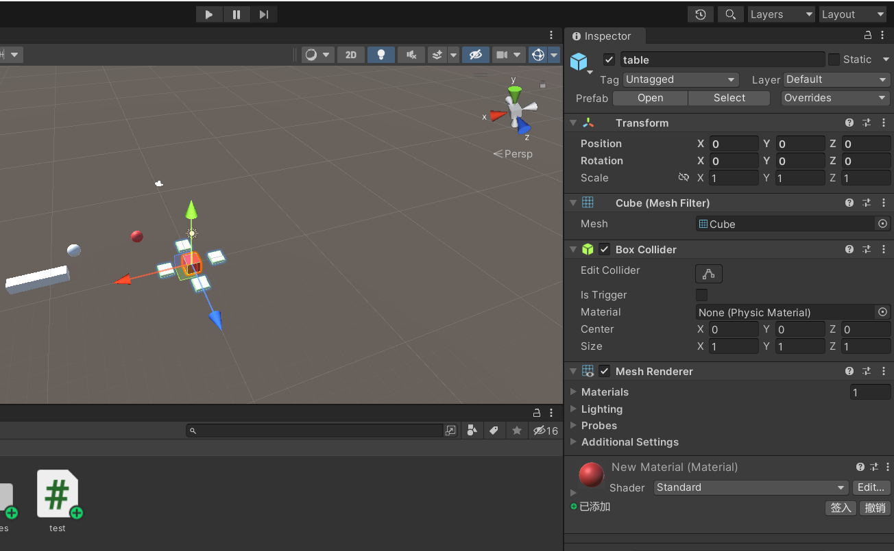
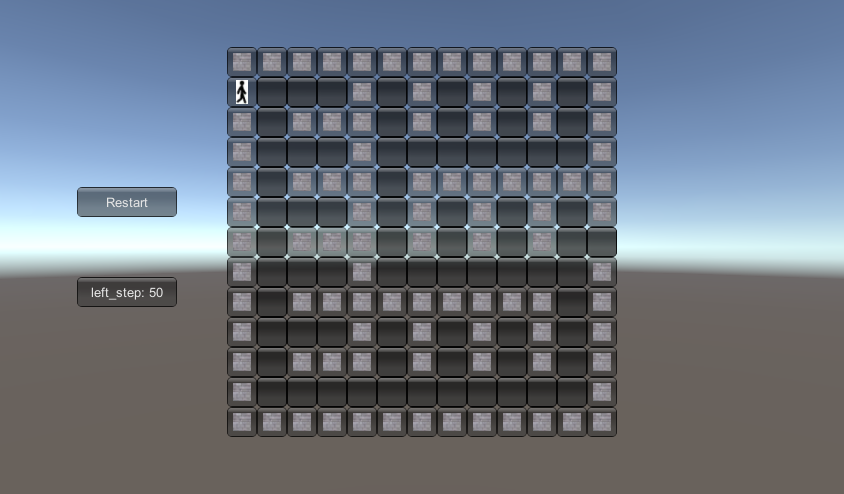
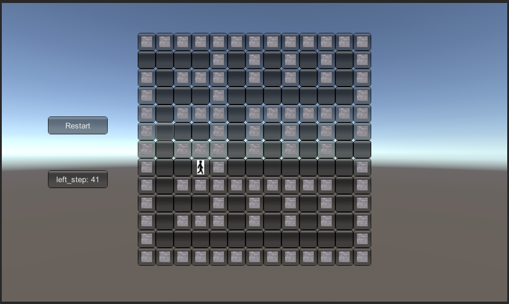
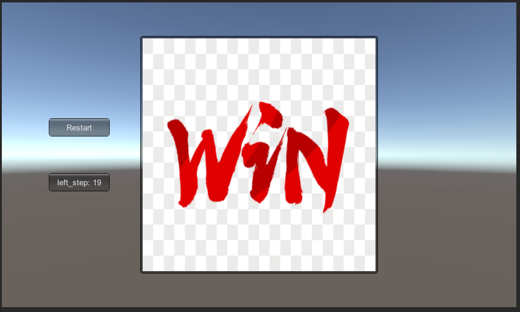
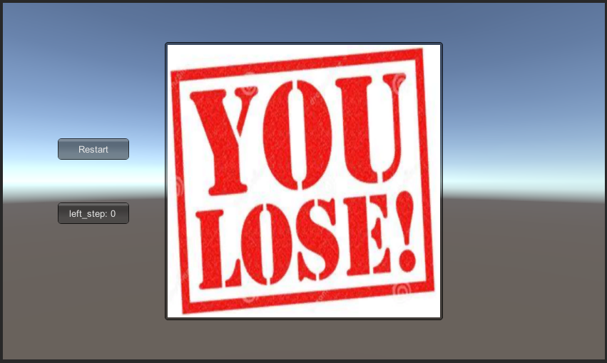

# 第二次3D编程作业
## 1. 简答题
- 解释 **游戏对象(GameObject)** 和 **资源(Asset)** 的区别和联系  
**游戏对象**: 游戏对象是 Unity 中的基础对象，用以表示角色、道具和景物。自身并没有太大作用，但可充当组件的容器，从而实现各种功能。  
**资源**: 资源的涵盖范围较广，包含游戏对象、外部图片/音频/视频、脚本、材质、场景等  
在Unity中，游戏对象是一种资源，如下图所示，游戏对象的文件储存在资源文件夹中  


- 下载几个游戏案例，分别总结资源、对象组织的结构  
  在这里我结合一个“跳一跳”游戏项目来回答相关问题，游戏截图如下:  
    
  在该项目中，其资源按照**功能**进行组织，功能相似的资源放在同一个文件夹下，如脚本、材料、预制对象各放在同一个文件夹下
    
  而对象则根据游戏物体的组成进行组织，如: 该游戏中的玩家由身体和头组成，则Player对象便由Body和Head两个子对象构成；地板和玩家之间没有组成与包含关系，所以分为Ground和Player两个单独对象
  
- 编写一个代码，使用debug语句来验证MonoBehaviour基本行为或事件触发的条件
  - 基本行为包括 Awake() Start() Update() FixedUpdate() LateUpdate()
  - 常用事件包括 OnGUI() OnDisable() OnEnable() 


  编写代码如下：
  ```C#  
  using System.Collections;
  using System.Collections.Generic;
  using UnityEngine;

  public class test : MonoBehaviour
  {
        void Awake()
        {
            Debug.Log("Awake");
        }
        // Start is called before the first frame update
        void Start()
        {
            Debug.Log("Start");
        }

        // Update is called once per frame
        void Update()
        {
            Debug.Log("Update");
        }
        void FixedUpdate()
        {
            Debug.Log("FixedUpdate");
        }
        void LateUpdate()
        {
            Debug.Log("LateUpdate");
        }
        void OnGUI()
        {
            Debug.Log("OnGUI");
        }
        void OnEnable()
        {
            Debug.Log("OnEnable");
        }
        void OnDisable()
        {
            Debug.Log("OnDisable");
        }
  }
  ```
  运行结果如下(执行速度太快，输出太多，只截取**开头和结尾**的运行结果)： 

  
    
  根据[Unity用户手册(点击查看)](https://docs.unity.cn/cn/2020.3/Manual/ExecutionOrder.html)，题目中所提到的脚本事件函数的执行顺序为：  
  Awake->OnEnable->Start->FixedUpdate->Update->LateUpdate->OnGUI->OnDisable   

        Awake: 场景加载时会为场景中的每个对象调用Awake函数;  
               在调用第一个 Start之前，所有Awake都要完成
        Start: 在第一帧之前或开始对象的物理更新之前需要调用 Start 函数
        Update: 在运行过程中每一帧调用一次Update。
        FixedUpdate: 在每次物理更新之前都会调用FixedUpdate，用于物理计算且独立于帧率，  
                     调用之间的默认时间为 0.02 秒。
        LateUpdate: 每一帧在调用所有Update函数后调用。
        OnEnable: 在对象变为启用和激活状态时调用。
        OnDisable: 在行为被禁用时调用，当对象销毁时也会调用该函数。
        OnGUI: 在渲染和处理GUI事件时调用，可以每帧调用多次(每个事件调用一次)。
- 查找脚本手册，了解 GameObject, Transform, Component 对象
  - 分别翻译官方对三个对象的描述
      - GameObject: Base class for all entities in Unity Scenes.   
        游戏对象: Unity场景中一切实体的基类   
      
      - Transform: Position, rotation and scale of an object.Every object in a Scene has a Transform. It's used to store and manipulate the position, rotation and scale of the object. Every Transform can have a parent, which allows you to apply position, rotation and scale hierarchically.  
        变换: 一个对象的位置、旋转和大小。场景中的所有对象都有一个变换，用于存储和操纵游戏对象的位置、旋转度、大小。每个变换都可以有父变换，使得可以层级化应用位置、旋转和大小。
     - Component: Base class for everything attached to GameObjects.  
       组件：附加到游戏对象的一切事物的基类
  - 描述下图的描述下图中 table 对象（实体）的属性、table 的 Transform 的属性、 table 的部件
    - 本题目要求是把可视化图形编程界面与 Unity API 对应起来，对 Inspector 面板上的每一个内容，应该知道对应 API。
    - 例如：table 的对象是 GameObject，第一个选择框是 activeSelf 属性。
    

    table为非静态的游戏对象，属性有Tag、Layer、isStatic、ActiveSelf
    Tranform的属性为Position(0,0,0)、Rotation(0,0,0)、Scale(1,1,1)  
    组件有：第一个下拉框是Transform，第二个下拉框是Cube，第三个下拉框是Box Collider，第四个下拉框是Mesh Renderer，第五个下拉框是材质。
    
  - 用UML图描述三者的关系  
      
- 资源预设 (Prefabs) 与对象克隆 (clone) 
  - 预设有什么好处  
    使用预设可在多个组件和资源之间重用属性设置，简化团队的工作流程。   
  - 预设与对象克隆(clone or copy or Instantiate of Unity Object)关系
    利用预设生成对象实例可以生成一个与预设相同的对象，生成的对象之间是相互联系的，修改预设或者其中一个对象会使所有由该预设生成的对象和预设产生变化。但对象克隆则生成了一个独立的对象，对该对象进行修改只会生效于其自身。
  - 制作table预设，写一段代码将table资源实例化成游戏资源  
    table预设:  
      
    代码:
    ```C#
    using System.Collections;
    using System.Collections.Generic;
    using UnityEngine;

    public class test : MonoBehaviour
    {
        // Start is called before the first frame update
        void Start()
        {
            GameObject obj = (GameObject)Instantiate(Resources.Load("table"));
            obj.transform.position = new Vector3(0,0,0);
        }

        // Update is called once per frame
        void Update()
        {  
        }
    }
    ```
    运行效果(将该脚本挂载到Camera):  
    **运行前**
      
    **运行后**  
    

## 2. 编程实践——走迷宫
- 基本构想  
  迷宫在逻辑上用一个矩阵maze表示，有三种组成成分：路(0)、墙(1)、人(2)， 
  各组成部分用具有不同贴图的按钮进行区分表示。在该游戏中，玩家需要控制“人”由起点走到终点，若“人”在规定步数内到达终点，游戏胜利；否则，游戏失败。
- 主要代码展示
  - 游戏初始化  
  **迷宫生成参考博客： https://zhuanlan.zhihu.com/p/48469251**
    ```C#
    void init_game()
    {
        left_step = 50; //设置初始剩余步数
        int k = size/2;
        maze = new int[size,size];; // 路-0, 墙-1, 人-2
        int[,] smaze = new int[k,k];
        Vector2Int[] points = new Vector2Int[k*k];
        
        
        for(int i  = 0; i < size;i++)
            for(int j = 0; j < size;j++)
                maze[i,j] = 1;
        
        for(int i=1; i < size-1; i=i+2)
        for(int j=1; j < size-1; j=j+2)
                maze[i,j] = 0;
        

        maze[begin_x,begin_y] = 0;
        maze[end_x,end_y] = 0;

        
        for(int i=0;i < k; i++)
        for(int j=0; j < k; j++)
                smaze[i,j] = 0;
        
        for(int i=0; i < k*k;i++) 
        {
            points[i].x = i/k;
            points[i].y = i%k;
        }

        for(int i=0;i < k; i++) 
        for(int j=0;j < k;j++)
          smaze[i,j] = 0;

        smaze[0,0] = 1;

        s.Push(points[0]);
        Vector2Int e;
        while(s.Count != 0) 
        {
            e = s.Pop();
            if(e.x-1>=0 && smaze[e.x-1,e.y]!=1)  //上 
            {
                smaze[e.x-1,e.y] = 1;
                maze[2*e.x,2*e.y+1] = 0; 	//打墙 
                s.Push(points[(e.x-1)*k+e.y]);	
            } 
            if(e.y+1<k  && smaze[e.x,e.y+1]!=1) //右 
            {
                smaze[e.x,e.y+1] = 1;      
                maze[2*e.x+1,2*(e.y+1)] = 0;    
                s.Push(points[(e.x)*k+e.y+1]);	
            }
            if(e.x+1<k && smaze[e.x+1,e.y]!=1)  //下 
            {
                smaze[e.x+1,e.y] = 1;
                maze[2*(e.x+1),2*e.y+1] = 0; 
                s.Push(points[(e.x+1)*k+e.y]);	
            }
            if(e.y-1>=0 && smaze[e.x,e.y-1]!=1)   //左 
            {
                smaze[e.x,e.y-1] = 1;
                maze[2*e.x+1,2*e.y] = 0;
                s.Push(points[(e.x)*k+e.y-1]);	
            }
      } 
        maze[begin_x,begin_y] = 2;
    }
    ``` 
  - 游戏结束判断
    ```C#
    bool if_win()
    {
        return maze[end_x,end_y] == 2;
    }

    bool if_lose()
    {
        return left_step==0;
    }
    ```
  - 判断相邻方格是否有"人"
    ```C#
    Vector2Int find_man(int x,int y)
    {
      if(x-1>=0 && maze[x-1,y]==2) return new Vector2Int(x-1,y);
      if(x+1< size && maze[x+1,y]==2) return new Vector2Int(x+1,y);
      if(y-1>=0 && maze[x,y-1]==2) return new Vector2Int(x,y-1);
      if(y+1<size && maze[x,y+1]==2) return new Vector2Int(x,y+1);
      return new Vector2Int(-1,-1);
    }
    ```
  - 游戏场景搭建
    ```C#
    void OnGUI()
    {
        if (GUI.Button(new Rect(left-150, Screen.height/2-2*btn_size, 100, btn_size), "Restart")) init_game();
        GUI.Button(new Rect(left-150, Screen.height/2+btn_size, 100, btn_size), "left_step: "+left_step.ToString());
        if(if_win())
        {
            GUI.Box(new Rect(left, up, size*btn_size, size*btn_size), win);
        }
        else if(if_lose())
        {
            GUI.Box(new Rect(left, up, size*btn_size, size*btn_size), lose);
        }
        else
        for (int i = 0; i < size; i++) 
        {
            for (int j = 0; j < size; j++) 
            {
                if (maze[i, j] == 0 && GUI.Button(new Rect(left + j * btn_size, 50 + i * btn_size, btn_size, btn_size), "")) 
                {
                    tem = find_man(i,j);
                    if(tem.x!=-1)
                    {
                        maze[i,j] = 2;
                        maze[tem.x,tem.y] = 0;
                        left_step--;
                    }
                }
                else if (maze[i, j] == 1) GUI.Button(new Rect(left + j * btn_size, 50 + i * btn_size, btn_size, btn_size), wall);
                else if (maze[i, j] == 0) GUI.Button(new Rect(left + j * btn_size, 50 + i * btn_size, btn_size, btn_size), "");
                else if (maze[i, j] == 2) 
                {
                    
                    GUI.Button(new Rect(left + j * btn_size, 50 + i * btn_size, btn_size, btn_size), man);
                }
            }
        }
    }
    ```

  - 完整代码
    ```C#
    using System.Collections;
    using System.Collections.Generic;
    using UnityEngine;

    public class Maze : MonoBehaviour
    {
        private int size = 13;
        private Stack<Vector2Int> s = new Stack<Vector2Int>();
        private int[,] maze;
        private Vector2Int tem;
        private int begin_x,begin_y,end_x,end_y;
        private Texture2D man,wall,win,lose;
        private int left,up,btn_size;
        private int left_step;
        // Start is called before the first frame update
        void Start()
        {
            begin_x = 1; begin_y = 0;
            end_x = size/2; end_y = size-1;
            man = (Texture2D) Resources.Load("man");
            wall = (Texture2D) Resources.Load("wall");
            win = (Texture2D) Resources.Load("win");
            lose = (Texture2D) Resources.Load("lose");
            init_game();
            btn_size = 30;
            left = (Screen.width-size*btn_size)/2;
            up = (Screen.height-size*btn_size)/2;
        }

      void OnGUI()
      {
          if (GUI.Button(new Rect(left-150, Screen.height/2-2*btn_size, 100, btn_size), "Restart")) init_game();
          GUI.Button(new Rect(left-150, Screen.height/2+btn_size, 100, btn_size), "left_step: "+left_step.ToString());
          if(if_win())
          {
              GUI.Box(new Rect(left, up, size*btn_size, size*btn_size), win);
          }
          else if(if_lose())
          {
              GUI.Box(new Rect(left, up, size*btn_size, size*btn_size), lose);
          }
          else
          for (int i = 0; i < size; i++) 
          {
              for (int j = 0; j < size; j++) 
              {
                  if (maze[i, j] == 0 && GUI.Button(new Rect(left + j * btn_size, 50 + i * btn_size, btn_size, btn_size), "")) 
                  {
                      tem = find_man(i,j);
                      if(tem.x!=-1)
                      {
                          maze[i,j] = 2;
                          maze[tem.x,tem.y] = 0;
                          left_step--;
                      }
                  }
                  else if (maze[i, j] == 1) GUI.Button(new Rect(left + j * btn_size, 50 + i * btn_size, btn_size, btn_size), wall);
                  else if (maze[i, j] == 0) GUI.Button(new Rect(left + j * btn_size, 50 + i * btn_size, btn_size, btn_size), "");
                  else if (maze[i, j] == 2) 
                  {
                      
                      GUI.Button(new Rect(left + j * btn_size, 50 + i * btn_size, btn_size, btn_size), man);
                  }
              }
          }
      }

      // Update is called once per frame
      void Update()
      {
          
      }

      bool if_win()
      {
          return maze[end_x,end_y] == 2;
      }

      bool if_lose()
      {
          return left_step==0;
      }

      Vector2Int find_man(int x,int y)
      {
          if(x-1>=0 && maze[x-1,y]==2) return new Vector2Int(x-1,y);
          if(x+1< size && maze[x+1,y]==2) return new Vector2Int(x+1,y);
          if(y-1>=0 && maze[x,y-1]==2) return new Vector2Int(x,y-1);
          if(y+1<size && maze[x,y+1]==2) return new Vector2Int(x,y+1);
          return new Vector2Int(-1,-1);
      }

      void init_game()
      {
          left_step = 50; //设置初始剩余步数
          int k = size/2;
          maze = new int[size,size];;// 路-0, 墙-1, 人-2
          int[,] smaze = new int[k,k];
          Vector2Int[] points = new Vector2Int[k*k];
          
          
          for(int i  = 0; i < size;i++)
              for(int j = 0; j < size;j++)
                  maze[i,j] = 1;
          
          for(int i=1; i < size-1; i=i+2)
          for(int j=1; j < size-1; j=j+2)
                  maze[i,j] = 0;
          

          maze[begin_x,begin_y] = 0;
          maze[end_x,end_y] = 0;

          
          for(int i=0;i < k; i++)
          for(int j=0; j < k; j++)
                  smaze[i,j] = 0;
          
          for(int i=0; i < k*k;i++) 
          {
              points[i].x = i/k;
              points[i].y = i%k;
          }

          for(int i=0;i < k; i++) 
          for(int j=0;j < k;j++)
            smaze[i,j] = 0;

          smaze[0,0] = 1;

          s.Push(points[0]);
          Vector2Int e;
          while(s.Count != 0) 
          {
              e = s.Pop();
              if(e.x-1>=0 && smaze[e.x-1,e.y]!=1)  //上 
              {
                  smaze[e.x-1,e.y] = 1;
                  maze[2*e.x,2*e.y+1] = 0; 	//打墙 
                  s.Push(points[(e.x-1)*k+e.y]);	
              } 
              if(e.y+1<k  && smaze[e.x,e.y+1]!=1) //右 
              {
                  smaze[e.x,e.y+1] = 1;      
                  maze[2*e.x+1,2*(e.y+1)] = 0;    
                  s.Push(points[(e.x)*k+e.y+1]);	
              }
              if(e.x+1<k && smaze[e.x+1,e.y]!=1)  //下 
              {
                  smaze[e.x+1,e.y] = 1;
                  maze[2*(e.x+1),2*e.y+1] = 0; 
                  s.Push(points[(e.x+1)*k+e.y]);	
              }
              if(e.y-1>=0 && smaze[e.x,e.y-1]!=1)   //左 
              {
                  smaze[e.x,e.y-1] = 1;
                  maze[2*e.x+1,2*e.y] = 0;
                  s.Push(points[(e.x)*k+e.y-1]);	
              }
        } 
          maze[begin_x,begin_y] = 2;
      }
    } 
    ``` 
  - 游戏截图
    - 游戏开始
    
    - 游戏中途
     
    - 游戏胜利
    
    - 游戏失败
     
  
  - 演示视频
  <video src="./game_video.mp4" width="800px" height="600px" controls="controls"></video>
