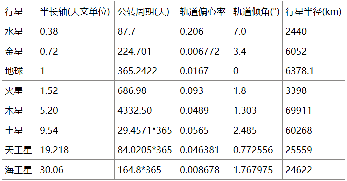
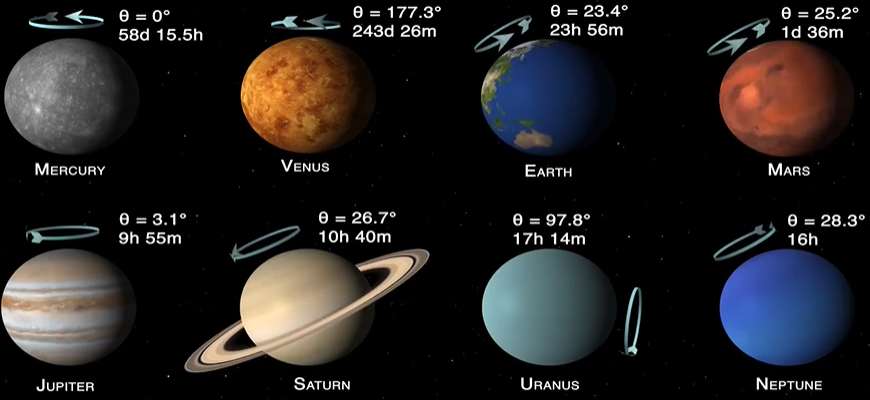
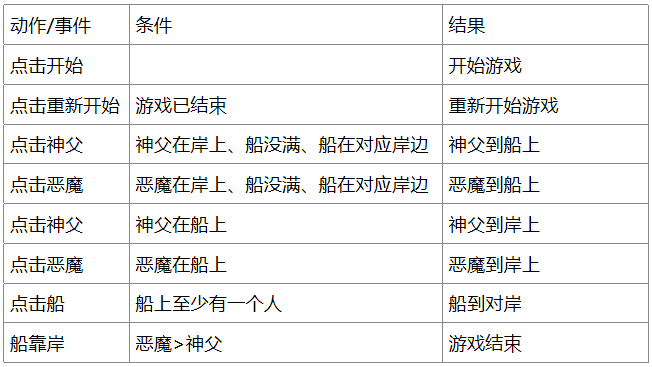
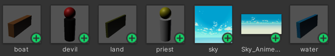
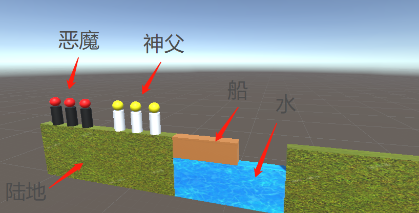

# 第三次3D编程作业

**本次作业源代码连接：点击此处进行跳转**
## 1. 简答并用程序验证
- 游戏对象运动的本质是什么  
  游戏对象空间属性(坐标、旋转度、大小)的变化

- 请用三种以上方法，实现物体的抛物线运动  
  此处我实现了y = -(z-20)*(z-20)/10 + 40 的抛物线轨迹，起始位置为(0,0,0)，z由0不断增大  
  法一：利用导数的性质
    ```C#
    public class Parabola1 : MonoBehaviour
    {
        private float speed = 1f;
        // Start is called before the first frame update
        void Start()
        {
            this.transform.position = Vector3.zero;
        }

        // Update is called once per frame
        void Update()
        {
            float old_z = this.transform.position.z;
            float dz = Time.deltaTime*speed;
            float dy = -dz*(old_z-20)/5;
            this.transform.position += new Vector3(0,dy,dz);  
        }
    }
    ```  

  法二：根据时间直接赋值位置
    ```C#
    public class Parabola2 : MonoBehaviour
    {
        // Start is called before the first frame update
        void Start()
        {
            this.transform.position = Vector3.zero;
        }

        // Update is called once per frame
        void Update()
        {
            float z = Time.time*2;
            float y = -(z-20)*(z-20)/10 + 40;
            this.transform.position = new Vector3(0,y,z);
        }
    }
    ```

  法三：两个脚本分别控制z坐标和x坐标
    ```C#
    public class Parabola3_1 : MonoBehaviour
    {
        private float speed = 1f;
        // Start is called before the first frame update
        void Start()
        {
            this.transform.position = Vector3.zero;
        }

        // Update is called once per frame
        void Update()
        {
            float old_z = this.transform.position.z;
            float dz = Time.deltaTime*speed;
            this.transform.position += new Vector3(0,0,dz);
        }
    }

    public class Parabola3_2 : MonoBehaviour
    {
        private float speed = 1f;
        // Start is called before the first frame update
        void Start()
        {
            
        }

        // Update is called once per frame
        void Update()
        {
            float old_z = this.transform.position.z;
            float dz = Time.deltaTime*speed;
            float dy = -dz*(old_z-20)/5;
            this.transform.position += new Vector3(0,dy,0);
        }
    }
    ```

- 写一个程序，实现一个完整的太阳系，其他星球围绕太阳的转速必须不一样，且不在同一个法平面上  
  为了尽量还原太阳系，首先需要上网查找太阳系各行星的相关资料，找到的相关资料如下： 
  
     
  其中文字资料收集源于百度百科，图片资料来自B站up主NASA宇宙的视频[(链接)]([https://www.bilibili.com/video/BV1F7411w7F7/?spm_id_from=333.1007.top_right_bar_window_history.content.click])  
  但是在实现过程中，我发现完全按真正比例还原一个太阳系对于我来说过于困难，我只能尽可能地使该模拟太阳系尽可能真实，以下是我的做法：  
  1. 各星体的大小比例虽然不准确，但是排序是正确的,且为了主要体现行星的自转和公转，缩小了轨道和形体之间的大小比例
  2. 行星公转的轨道用正圆代替(尝试过用椭圆，但是表现出来的效果几乎与正圆一致)，正圆的半径与行星公转轨迹的半长轴成正比，且轨迹的倾角与现实值一致，但是倾角较小，运行过程中需要留意查看
  3. 在模拟中，各行星的自转轴与方向与现实一致，各行星的自转周期的比值与现实一致
  4. 为了更明显的体现出自转和公转，加快了转速，使得行星自转周期与公转周期的比值与现实并不相同 
  5. 太阳并不位于轨道中心，但在缩放比例之后，太阳半径相对于水星的公转轨迹半长轴相差无几，也就很难体现出太阳的非圆心性，所以干脆将太阳作为轨道圆心

 
  相关代码如下：[源代码下载]()
  - 记录公转轨迹的脚本：LineMark
  ```C#
  using System.Collections;
  using System.Collections.Generic;
  using UnityEngine;
  public class LineMark : MonoBehaviour 
  {
    private GameObject clone;  
    private LineRenderer line;  
    private int i;  
    public GameObject obs;  
    private GameObject run;  
    Vector3 RunStart;
    Vector3 RunNext;
  
    // Use this for initialization
    void Start () 
    {
      run = this.gameObject;
      RunStart = run.transform.position;
      clone = (GameObject)Instantiate(obs, run.transform.position, run.transform.rotation);//克隆一个带有LineRender的物体   
      line = clone.GetComponent<LineRenderer>();//获得该物体上的LineRender组件  
      float line_width = this.gameObject.transform.localScale.x/4;
      line.startWidth = line_width ;//设置宽度 
      line.endWidth = line_width; 
      i = 0;
    }
  
    // Update is called once per frame  
    void Update () 
    {  
      if(Time.time>=3)
      {
        RunNext = run.transform.position;
        if (RunStart != RunNext) 
        {
          i++;
          line.positionCount = i;//设置顶点数
          line.SetPosition(i-1, run.transform.position);
        }
        RunStart = RunNext;
      }
    
    }  
  }
  ```
  - 行星公转脚本：RotateAroundSun
  ```C#
  using System.Collections;
  using System.Collections.Generic;
  using UnityEngine;

  public class RotateAroundSun : MonoBehaviour
  {
      private Vector3 point,axis;
      private float cycle,a,alpha;
      public float angle,a_pre,cycle_pre;// angle—轨道倾角, a_pre—半长轴(天文单位), cycle_pre—公转周期(天)
      // Start is called before the first frame update
      void Start()
      {
          alpha = (angle/180)*Mathf.PI;// 将倾角转换为PI表示
          a = 400*a_pre;// 这两个常量由实践得出
          cycle = cycle_pre/10000;
          this.transform.position = new Vector3(a,a*Mathf.Tan(alpha),0);// 根据倾角和半长轴得到起始位置
          point = new Vector3(0,0,0);//圆心为(0,0,0)，太阳所处位置
          axis = new Vector3(-Mathf.Tan(alpha),1,0);// 根据倾角获得公转轴
      }

      // Update is called once per frame
      void Update()// 根据公转轴进行旋转
      {
          Quaternion q = Quaternion.AngleAxis(1/cycle*Time.deltaTime,axis);
          this.transform.position = q*(this.transform.position);
      }
  }
  ```
  - 行星自转脚本：Spin
  ```C#
  using System.Collections;
  using System.Collections.Generic;
  using UnityEngine;

  public class Spin : MonoBehaviour
  {
      private Vector3 axis;
      private float cycle;
      public float angle,cycle_pre;// cycle_pre—自转周期(天)
      // Start is called before the first frame update
      void Start()
      {
          // 生成一个相应的自转轴实体并附着在行星上
          Transform origin_transform = this.gameObject.transform;
          GameObject axis_entity = GameObject.CreatePrimitive(PrimitiveType.Cylinder);
          axis_entity.transform.parent = origin_transform;
          axis_entity.transform.localPosition = Vector3.zero;
          axis_entity.transform.localScale = 
              new Vector3(0.05f,1f,0.05f);
            
          // 获取自转轴，并根据自转轴把行星倾斜过来
          axis = new Vector3(Mathf.Tan(angle/180*Mathf.PI),1.0f,0.0f);
          this.gameObject.transform.up = axis;
          cycle = cycle_pre/200;
            
      }

      // Update is called once per frame
      void Update()
      {
          this.transform.Rotate(axis,1/cycle*Time.deltaTime,Space.World);
      }
  }
  ``` 
  由于演示视频时间较长，[请点击该链接进行查看](https://www.bilibili.com/video/BV1y14y1j7X8/?vd_source=057a2b7e5be3dc8b29f8d32fd4e65aeb)

## 2. 编程实践
- 游戏描述
```
Priests and Devils is a puzzle game in which you will help the Priests and Devils to cross the river within the time limit.   
Here are 3 priests and 3 devils at one side of the river. They all want to get to the other side of this river,
but there is only one boat and this boat can only carry two persons each time.   
And there must be one person steering the boat from one side to the other side. 
In the flash game, you can click on them to move them and click the go button to move the boat to the other direction.
If the priests are out numbered by the devils on either side of the river, they get killed and the game is over.
You can try it in many > ways. Keep all priests alive! Good luck!
```
- 游戏实现
1. 游戏事物：神父、恶魔、船、陆地、水
2. 玩家动作表

3. 制作预制体


4. 主要代码  
由于代码过多，所以我挑选重要部分进行展示，[完整代码请点击该链接下载 ]()，
[直接查看游戏效果请点击该链接](https://www.bilibili.com/video/BV1rW4y177Ep/?vd_source=057a2b7e5be3dc8b29f8d32fd4e65aeb);  

    1. SSDirector.cs ：SSDirector类和ISceneController接口  
      SSDirector负责游戏场景的切换，为单实例类，在本游戏中只有单个场景，就没有实现场景切换  
      ISceneController是场记类必须实现的接口，便于SSDirector进行指挥  
      
        ```C#
        public interface ISceneController
        {
            void load_resources();// 加载场景资源
            void update_game_status();// 更新游戏状态
        }

        public class SSDirector : System.Object
        {

            private static SSDirector _instance;
            private ISceneController cur_controller;// 当场场记

            public static SSDirector get_director()
            {
                if(_instance ==null) _instance = new SSDirector();
                return _instance;
            }

            public void set_controller(ISceneController controller)
            {
                cur_controller = controller;
            }

            public ISceneController get_controller()
            {
                return cur_controller;
            }
        }
        ```
    2.  UserGUI.cs ：GUI类和IUserAction接口  
      GUI类：用于部分玩家界面的显示，部分玩家交互(开始、重新开始)由该类完成
      IUserAction接口：场记类需要实现的接口，进行玩家交互
        ```C#
        using UnityEngine;

        public interface IUserAction 
        {
            void restart();// 重新开始
            void move_boat();// 移动船
            void move_role(RoleModel r);// 移动人
            void start_to_game();// 由开始界面转到游戏界面
        }

        public enum Game_Status// 游戏状态枚举类
        {
            Start,// 开始界面
            Gameing,// 游戏中
            Success,// 游戏成功，结束
            Loss// 游戏失败，结束
        };

        public class UserGUI : MonoBehaviour
        {
            private IUserAction action;
            private Game_Status status;
            // Start is called before the first frame update
            void Start()
            {
                status = Game_Status.Start;
            }

            void OnGUI()// 根据当前游戏状态进行GUI渲染
            {
                if(status==Game_Status.Start)
                {
                    // 省略...
                }
                if(status==Game_Status.Success)
                {
                    // 省略...
                }
                if(status==Game_Status.Loss)
                {
                    // 省略
                }
            }
            public void set_action(IUserAction a)
            {
                action = a;
            }
            public void set_status(Game_Status s)
            {
                status =  s;
            }
            public Game_Status get_status()
            {
                return status;
            }
        }
        ```
      3. LandModel.cs ：LandModel类  
        LandModel类代表游戏中的陆地，会存储在这块陆地上的RoleModel(代表人，后面会提到)，为RoleModel提供上岸、离岸的方法  

          ```C#
          using UnityEngine;

          public class LandModel:System.Object
          {
              int pos;// 0——左  1——右
              RoleModel[] priests;// 从里到外分别是0、1、2
              RoleModel[] devils;// 从里到外分别是0、1、2
              GameObject land;
              // 静态成员，看做常量，便于调整，存储人物队列相关位置
              public static Vector3 priest_l_l = new Vector3(-11,6,0);
              public static Vector3 devil_l_l = new Vector3(-19,6,0);
              public static Vector3 priest_r_r = new Vector3(11,6,0);
              public static Vector3 devil_r_r = new Vector3(19,6,0);

              public LandModel(GameObject l,int p)
              {
                  land = l;
                  pos = p;
                  priests = new RoleModel[3];
                  devils = new RoleModel[3];
                  for(int i = 0; i < 3;i++)
                  {
                      priests[i] = null;
                      devils[i] = null;
                  }
              }

              void set_pos(int p) {pos=p;}
              int get_pos() {return pos;}

              public GameObject get_land()
              {
                  return land;
              }

              public int get_priest_idx()// 获取空闲的神父队列坐标
              {
                  for(int i = 0; i < 3;i++)
                  {
                      if(priests[i]==null)
                          return i;
                          // return (LandModel.priest_l_l + new Vector3(2*i,0,0));
                  }
                  return -1;
              }

              public int get_priest_num()// 获取岸上的神父数量
              {
                  int count = 0;
                  for(int i = 0; i < 3;i++)
                  {
                      if(priests[i]!=null)
                          count += 1;
                          // return (LandModel.priest_l_l + new Vector3(2*i,0,0));
                  }
                  return count;
              }

              public int get_devil_idx()// 获取空闲的恶魔队列坐标
              {
                  ...
              }

              public int get_devil_num()// 获取岸上的恶魔数量
              {
                  ...
              }
              
              public int get_idx(RoleModel role)// 获取人物的空闲坐标
              {
                  // 结合人物身份
                  if(role.get_type()==0) return get_priest_idx();
                  else return get_devil_idx();
              }
              public Vector3 enland(RoleModel role)// 上岸
              {
                  
                  int loc;
                  if(role.get_type()==0)// 神父
                  {
                      loc = get_priest_idx();
                      priests[loc] = role;
                      return pos==0?(LandModel.priest_l_l + new Vector3(2*loc,0,0)):(LandModel.priest_r_r - new Vector3(2*loc,0,0));
                  }
                  else// 恶魔
                  {
                      loc = get_devil_idx();
                      devils[loc] = role;
                      return pos==0?(LandModel.devil_l_l + new Vector3(2*loc,0,0)):(LandModel.devil_r_r - new Vector3(2*loc,0,0));
                  }
              }

              public void unland(RoleModel role,int loc)// 离岸
              {
                  if(role.get_type()==0)
                  {
                      priests[loc] = null;
                  }
                  else
                  {
                      devils[loc] = null;
                  }
              }
          }
          ```
      4. RoleModel.cs ：RoleModel类  
        RoleModel代表人物，其中包含Click脚本实体和Move脚本实体( 这两个脚本分别用来处理点击事件和移动，会在后面介绍 )
          ```C#
            using UnityEngine;

            public class RoleModel:System.Object
            {
                public GameObject role;// 游戏实体
                private int type;// 0——神父  1——恶魔
                private ISceneController controller;// 指挥该模型的场记
                private Move move;// 处理移动
                private Click click;// 处理点击
                private int seat;// 船上位置
                private int idx;// 陆地上坐标(0、1、2)
                private int land_loc;// 陆地位置(0——左，1——右)
                private float speed;// 移动速度
                public RoleModel(ISceneController c,GameObject r,int l_loc,int typ,int index,float s)
                {
                    controller = c;
                    speed = s;
                    role = r;
                    move = role.AddComponent<Move>() as Move;
                    move.set_speed(10f);
                    move.set_move_status(false);
                    move.set_destination(role.transform.position);
                    click = role.AddComponent<Click>() as Click;
                    click.set_role(this);
                    seat = -1;
                    land_loc = l_loc;
                    type = typ;
                    idx = index;
                }

                public void set_type(int t) {type = t;}
                public int get_type() {return type;}
                public void set_idx(int i) {idx = i;}
                public int get_idx() {return idx;}
                public void set_land_loc(int l) {land_loc = l;}
                public int get_land_loc() {return land_loc;}
                public void set_role(GameObject r)
                {
                    role = r;
                }
                public int get_seat()
                {
                    return seat;
                }
                public GameObject get_role()
                {
                    return role;
                }
                
                // 人物模型根据当前状态移动
                public void leave(BoatModel boat,LandModel land)
                {
                    if(move.get_move_status()) return;// 人物正在移动，需要等到移动完才能进行第二次移动
                    if(boat.get_move_status()) return;// 船正在移动
                    if(seat==-1)// 在岸上
                    {
                        // 船做好登船准备
                        int tem_seat= boat.ship(this);

                        if(tem_seat==-1) return;//没位置，无法登船
                        
                        // 地做好离地准备
                        land.unland(this,idx);

                        // 切换位置状态
                        seat = tem_seat;
                        land_loc = -1;
                        idx = -1;
                        move.move_to(boat.get_pass_position(seat),speed);
                    }
                    else// 在船上
                    {
                        int boat_loc = boat.get_pos();
                        int tar_idx = land.get_idx(this);

                        // 船做好下船准备
                        boat.unship(this,seat);

                        // 地做好登陆准备
                        Vector3 tar_position = land.enland(this);// 会修改数组

                        // 切换位置状态
                        seat = -1;
                        land_loc = boat_loc;
                        idx = tar_idx;
                        move.move_to(tar_position,speed);
                        
                    }
                }
            }
            ```
      5. BoatModel.cs ：BoatModel类  
        BoatModel类代表船，包含Move和Click脚本，同时会存储在船上的乘客，同时有两个Check_Wait脚本(后面展示)，可视为等待队列，用来判断乘客是否已经下船或者上船，以保证游戏真实性，确保不会出现凌空飞行的情况
          ```C#
          using UnityEngine;

          public class BoatModel:System.Object
          {
              public GameObject boat;
              private ISceneController cur_controller;
              private int pos;// 0——左  1——右
              private Move move;
              private Click click;
              private Check_Wait check_wait_enship;// 判断所等乘客是否已上船
              private Check_Wait check_wait_unship;// 判断上岸乘客是否已下船
              RoleModel[] passengers;// 0——左  1——右
              private int[] waits;// 各个座位是否有等待，是——1  否——0
              private float speed;

              // 静态成员，看做常量，便于调整，乘客相对位置 + 船靠岸的绝对位置
              static Vector3 seat_left = new Vector3(-1.5f,1f,0);
              static Vector3 seat_right = new Vector3(1.5f,1f,0);
              static Vector3 stop_left = new Vector3(-2,5,0);
              static Vector3 stop_right = new Vector3(2,5,0);

              public BoatModel(GameObject b,float s)
              {
                  speed = s;
                  boat = b;
                  move = boat.AddComponent<Move>();
                  move.set_speed(speed);
                  move.set_move_status(false);
                  move.set_destination(boat.transform.position);
                  pos = 0;
                  passengers = new RoleModel[2];
                  passengers[0] = null;
                  passengers[1] = null;
                  
                  click = boat.AddComponent<Click>();
                  click.set_boat(this);

                  waits = new int[2];// 只有两个座位，所以只开2的大小
                  waits[0] = 0;
                  waits[1] = 0;

                  check_wait_enship = boat.AddComponent<Check_Wait>();
                  check_wait_enship.set_boat(this);
                  check_wait_enship.set_type(0);

                  check_wait_unship = boat.AddComponent<Check_Wait>();
                  check_wait_unship.set_boat(this);
                  check_wait_unship.set_type(1);
              }

              public void set_pos(int p) {pos=p;}
              public int get_pos() {return pos;}
              public void set_boat(GameObject b)
              {
                  boat = b;
              }
              public GameObject get_boat()
              {
                  return boat;
              }
              
              int get_pass_num()
              {
                  int count = 0;
                  for(int i = 0; i < 2; i++)
                      if(passengers[i]!=null)
                          count++;
                  return count;
              }

              public bool get_move_status()
              {
                  return move.get_move_status();
              }

              // 为RoleModel提供上船方法，并返回空座位编号
              public int ship(RoleModel role)
              {
                  int seat = -1;
                  if(move.get_move_status()) // 船在动，不给上
                  {
                      return seat;
                  }
                  if(role.get_land_loc() != pos) // 船和人不在同一边
                  {
                      return seat;
                  }
                  if(passengers[0]==null)
                      seat = 0;
                  else if(passengers[1]==null)
                      seat = 1;
                  else 
                  {
                      return seat;
                  }
                  passengers[seat] = role;// 设置位置上的乘客

                  waits[seat]=1;
                  start_wait(seat);// 开始等待乘客到达指定座位
                  return seat;
              }

              // 为RoleModel提供下船方法
              public void unship(RoleModel role,int seat)
              {
                  if(passengers[seat]!=role) return;

                  // 等待乘客下船，设置等待下船队列
                  int wait_idx = check_wait_unship.get_empty();// 下船等待队列的编号
                  check_wait_unship.set_wait(wait_idx);
                  Vector3 des;// 计算岸边的位置，乘客到达该位置代表已下船
                  if(get_pos()==0)
                  {
                      des = stop_left - new Vector3(boat.transform.localScale.x/2,0,0) + new Vector3(0,1f,0);
                  }
                  else
                  {
                      des = stop_right + new Vector3(boat.transform.localScale.x/2,0,0) + new Vector3(0,1f,0) ;
                  }

                  check_wait_unship.set_role(wait_idx,role);// 设置在等的人
                  check_wait_unship.set_destination(wait_idx,des);// 设置等待位置

                  passengers[seat] = null;
                  role.get_role().transform.SetParent(null);// 解除父子关系
              }
              // 返回还没上船的乘客数量
              int get_wait_num()
              {
                  return waits[0] + waits[1];
              }
              // 船根据当前状态进行移动
              public void leave()
              {
                  if(check_wait_enship.get_wait_num()>0) return;// 在等乘客上船，无法移动
                  if(check_wait_unship.get_wait_num()>0) // 在等乘客下船，无法移动
                  {
                      return;
                  }
                  if(get_pass_num()==0)// 船上没人，无法移动
                  {
                      return;
                  } 
                  if(move.get_move_status())// 正在移动，等结束才能在移动
                  {
                      return;
                  }
                  if(pos==0)// 船在左岸
                  {
                      move.move_to(stop_right,speed);
                      pos = 1;
                  }
                  else
                  {
                      move.move_to(stop_left,speed);
                      pos = 0;
                  }
              }

              // 根据座位编号获取坐标
              public Vector3 get_pass_position(int seat)
              {
                  return boat.transform.position + (seat==0?seat_left:seat_right);
              }
              public RoleModel get_passenger(int seat)
              {
                  return passengers[seat];
              }

              // 开始等待座位为seat的乘客上船
              public void start_wait(int seat)
              {
                  Vector3 des = pos==0?stop_left + (seat==0?seat_left:seat_right): stop_right + (seat==0?seat_left:seat_right);// 计算乘客目标位置
                  waits[seat] = 1;// 座位等待开启
                  // 设置等待上船的脚本
                  check_wait_enship.set_destination(seat,des);
                  check_wait_enship.set_wait(seat);
                  check_wait_enship.set_role(seat,passengers[seat]);
              }

              // 结束等待
              public void end_wait(int seat,int type)// type: 0——上船 1——下船
              {
                  if(type==0)
                  {
                      passengers[seat].get_role().transform.parent = boat.transform;// 设置乘客和船的一体关系
                      waits[seat] = 0;// 关闭座位等待
                  }
                  
              }
            
          }

          ```
        
      6. SceneController.cs ：SceneController类  
      SceneController类负责调配某一游戏场景中的各种游戏对象
          ```C#
          using UnityEngine;

          public class SceneController : MonoBehaviour,ISceneController,IUserAction
          {
              GameObject water;
              LandModel left_land,right_land;
              BoatModel boat;
              RoleModel[] priests;
              RoleModel[] devils;
              UserGUI gui;
              Camera camera;
              Light light;
              void Awake()
              {
                  SSDirector director = SSDirector.get_director();
                  director.set_controller(this);
                  
                  load_resources();
              }
              public void load_resources()
              {
                  load_non_entity();
                  load_entity();
              }
              private void load_non_entity()// 加载各类非实体对象
              {
                  //初始化光源
                  light = Instantiate(new GameObject(),new Vector3(0,20,15),Quaternion.Euler(20,20,0)).AddComponent<Light>();
                  light.type = LightType.Directional;

                  // 初始化相机
                  camera = Instantiate(new GameObject(),new Vector3(0,20,-15),Quaternion.identity).AddComponent<Camera>();
                  camera.orthographic = true;
                  camera.orthographicSize = 10;
                  camera.gameObject.AddComponent<Move>();
                  Skybox sky = camera.gameObject.AddComponent<Skybox>();
                  sky.material = Resources.Load<Material>("hw_3/sky");

                  // 初始化GUI
                  gui = camera.gameObject.AddComponent<UserGUI>();
                  gui.set_action(this);
                  gui.set_status(Game_Status.Start);
              }
              private void load_entity()
              {
                  // 初始化水
                    ...
                  // 初始化左地
                    ...
                  // 初始化右地
                    ...
                  // 初始化船
                    ...
                  
                  // 初始化神父和恶魔
                  priests = new RoleModel[3];
                  devils = new RoleModel[3];
                  
                  for(int i = 0; i < 3; i++)
                  {
                      RoleModel priest,devil;

                      GameObject priest_object = Resources.Load("hw_3/priest") as GameObject;

                      priest_object.transform.position = (LandModel.priest_l_l + new Vector3(2*i,0,0));
                      priest = new RoleModel(this,Instantiate(priest_object),0,0,i,10.0f);

                      left_land.enland(priest);
                      priests[i] = priest;
                      
                      GameObject devil_object = Resources.Load("hw_3/devil") as GameObject;
                      devil_object.transform.position = (LandModel.devil_l_l + new Vector3(2*i,0,0));
                      devil = new RoleModel(this,Instantiate(devil_object),0,1,i,10.0f);
                      left_land.enland(devil);
                      devils[i] = devil;
                  }
              }

              public void move_boat()
              {
                  if(gui.get_status()!=Game_Status.Gameing) return;// 如果不是游戏中状态，无法移动
                  boat.leave();
              }
              public void move_role(RoleModel role)
              {
                  if(gui.get_status()!=Game_Status.Gameing) return;
                  int seat = role.get_seat();
                  if(seat==-1)// 在岸上
                  {
                      if(role.get_land_loc()==0)
                          role.leave(boat,left_land);
                      else
                          role.leave(boat,right_land);
                  }
                  else// 在船上
                  {
                      if(boat.get_pos()==0)
                          role.leave(boat,left_land);
                      else
                          role.leave(boat,right_land);
                  }
              }
              public void start_to_game()
              {
                  Move m = camera.gameObject.GetComponent<Move>();
                  m.move_to(new Vector3(0,8,-10),5f);
              }

              public void restart()
              {
                  Destroy(water);
                  Destroy(left_land.get_land());
                  Destroy(right_land.get_land());
                  Destroy(boat.get_boat(),0.2f);
                  for(int i = 0; i < 3;i++)
                  {
                      Destroy(priests[i].get_role());
                      Destroy(devils[i].get_role());
                  }
                  load_entity();
                  gui.set_status(Game_Status.Gameing);
              }

              public Game_Status check_game_status()// 检查游戏状态并返回
              {
                  //求出左右边各自的神父数量和恶魔数量，并据此判断游戏状态
                    ...
              }

              public void update_game_status()
              {
                  gui.set_status(check_game_status());
              }
          }
          ```
      7. Click.cs ：Click脚  
      处理船和人的点击事件
          ```C#
          using UnityEngine;

          public class Click : MonoBehaviour
          {
              BoatModel boat;
              RoleModel role;
              IUserAction action;
              // Start is called before the first frame update
              void Start()
              {
                  action = SSDirector.get_director().get_controller() as IUserAction;
              }

              public void set_boat(BoatModel b)
              {
                  boat = b;
              }

              public void set_role(RoleModel r)
              {
                  role = r;
              }
              public BoatModel get_boat()
              {
                  return boat;
              }

              public RoleModel get_role()
              {
                  return role;
              }
              public void OnMouseDown()
              {
                  if(boat==null&&role==null) return;
                  if(boat!=null)// 点击的是船
                  {
                      action.move_boat();
                  }
                  else// 点击的是人
                  {
                      action.move_role(role);
                  }
              }
          }
          ```
      8. Move.cs ：Move脚本  
      控制船和人的移动 
          ```C#
          using UnityEngine;

          public class Move : MonoBehaviour
          {
              private Vector3 destination;// 移动目的地
              private float speed;
              private bool move_status;// false——静止  true——移动

              // Start is called before the first frame update
              void Start()
              {

              }

              // Update is called once per frame
              void Update()
              {
                  // 如果物体正在移动且物体已经到达目的地
                  if(move_status && Vector3.Distance(this.gameObject.transform.position,destination)==0f)
                  {
                      move_status = false;// 停止
                      SSDirector.get_director().get_controller().update_game_status();// 更新游戏状态，一般用于船靠岸
                  }
                  // 如果出于移动状态，则向目的地移动
                  if(move_status)
                  {
                      this.gameObject.transform.position 
                          = Vector3.MoveTowards(this.gameObject.transform.position,destination,speed*Time.deltaTime);
                  }
              }

              // 设置移动信息
              public void move_to(Vector3 des,float s)
              {
                  speed = s;
                  destination = des;
                  move_status = true;
              }

              public void set_move_status(bool m) {move_status = m;}
              public bool get_move_status() {return move_status;}
              public void set_speed(float s) {speed = s;}
              public float get_speed() {return speed;}
              public void set_destination(Vector3 des) {destination = des;}
              public Vector3 get_destination() {return destination;}
          }

          ```
      9. Check_Wait.cs ：Check_Wait脚本
          ```C#
          using UnityEngine;

          public class Check_Wait : MonoBehaviour
          {
              private int type;// 0——等待上船 1——等待下船
              private int[] waits;// 正在等待的物体的队列
              private BoatModel boat;
              private Vector3[] destinations;// 正在等待的物体的目的地
              private RoleModel[] roles;// 在该游戏中，只用来处理人
              public void set_boat(BoatModel b)
              {
                  boat = b;
              }
              public void set_destination(int seat,Vector3 des)
              {
                  destinations[seat] = des;
              }
              public void set_wait(int w_s)
              {
                  waits[w_s] = 1;
              }
              public void set_role(int seat,RoleModel role)
              {
                  roles[seat] = role;
              }
              public void set_type(int t)
              {
                  type = t;
              }
              public int get_wait_num()
              {
                  return waits[0] + waits[1];
              }
              public int get_empty()
              {
                  if(waits[0]==0) return 0;
                  else return 1;
              }
              // Start is called before the first frame update
              void Start()
              {
                  // 只有两个乘客，所以某类等待至多只用等2人，数组只开2大小
                  destinations = new Vector3[2];
                  roles = new RoleModel[2];
                  waits = new int[2];
                  waits[0] = 0;
                  waits[1] = 0;
              }
              // Update is called once per frame
              void Update()
              {
                  // Debug.LogFormat("waits[0]:{0}",waits[0]);
                  // Debug.LogFormat("waits[0]:{0}",waits[1]);
                  if(waits[0] ==1 )// 在等0号位
                  {
                      
                      GameObject wait_object = roles[0].get_role();    
                      float dis = Vector3.Distance(wait_object.transform.position,destinations[0]);// 所等乘客的检测位置


                      // 由于等待下船时人的最终目的地并不是我们的等待目的地
                      // 害怕由于卡顿使得过了目的地但检测不到可以结束等待，故不直接用 dis == 0
                      // 此处0.05较小，不影响游戏整体流畅性

                      // 结束等待
                      if(dis <= 0.05f)
                      {
                          boat.end_wait(0,type);// 通知船结束等待
                          waits[0] = 0;
                          roles[0] = null;
                      }           
                  }
                  if(waits[1] == 1 )// 在等1号位
                  {
                      
                      GameObject wait_object = roles[1].get_role();      
                      float dis = Vector3.Distance(wait_object.transform.position,destinations[1]);// 所等乘客的检测位置
                      
                      // 同上，结束等待
                      if(dis <= 0.05f)
                      {
                          boat.end_wait(1,type);// 通知船结束等待
                          waits[1] = 0;
                          roles[1] = null;
                      }           
                  }
              }
          }

          ```

  5. 运行效果   
  无法在markdown中放上视频，[请点击该链接进行查看](https://www.bilibili.com/video/BV1rW4y177Ep/?vd_source=057a2b7e5be3dc8b29f8d32fd4e65aeb)。 
  