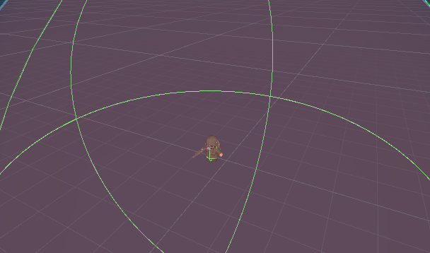
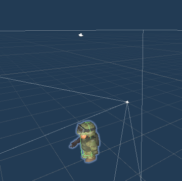
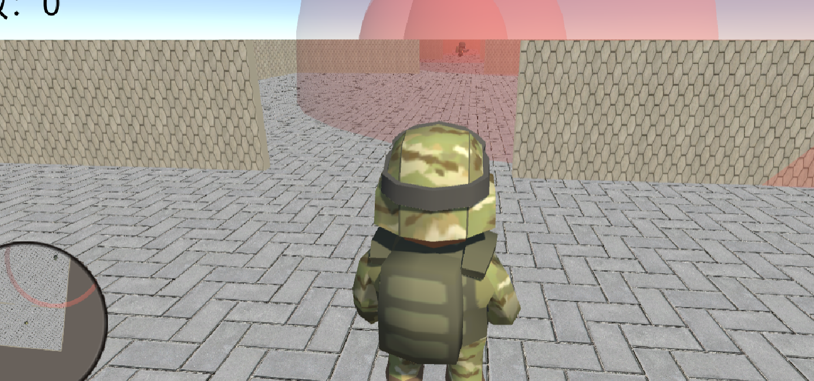
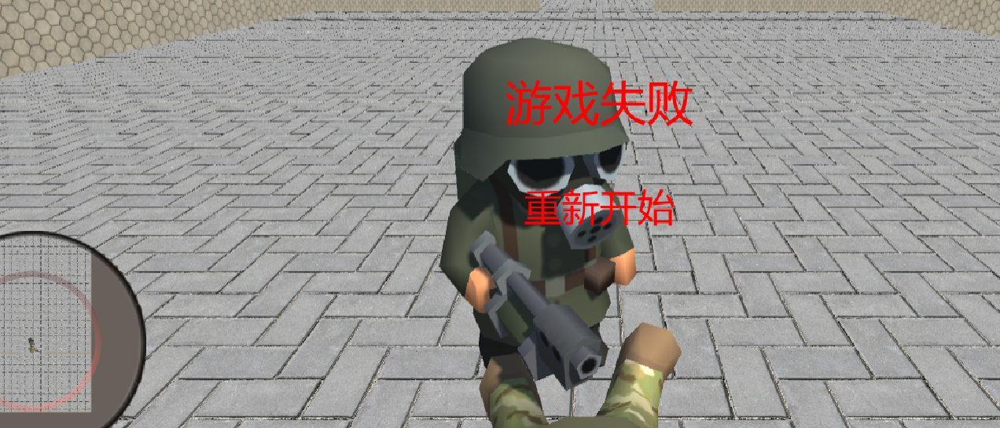
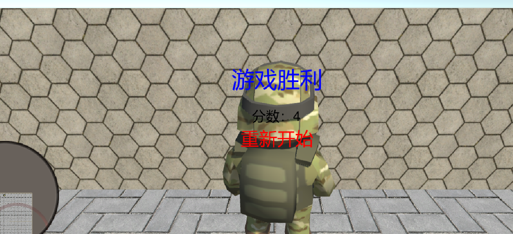

# 第七次3D编程作业：智能巡逻兵

[**本次作业源代码链接：点击此处进行跳转**](https://github.com/BrodicVan/3D_game)  
[**游戏视频**](https://www.bilibili.com/video/BV1h84y147kv/?vd_source=057a2b7e5be3dc8b29f8d32fd4e65aeb)
## 一、作业要求

- 游戏设计要求

    - 创建一个地图和若干巡逻兵(使用动画)；
每个巡逻兵走一个3~5个边的凸多边型，位置数据是相对地址。即每次确定下一个目标位置，用自己当前位置为原点计算；  
    - 巡逻兵碰撞到障碍物，则会自动选下一个点为目标；
巡逻兵在设定范围内感知到玩家，会自动追击玩家；
失去玩家目标后，继续巡逻；
    - 计分：玩家每次甩掉一个巡逻兵计一分，与巡逻兵碰撞游戏结束；
- 程序设计要求
  - 必须使用订阅与发布模式传消息
  - 工厂模式生产巡逻兵


## 二、游戏内容简述
使用WSAD前后左右移动player，按住shift可以加速，移动鼠标可以转动方向。进入巡逻兵的追捕范围后逃脱可以加一分，若与巡逻兵碰撞则游戏结束，到达地图终点即可获胜。

## 三、游戏实现
**作业代码较多，此博客只挑选部分进行展示，[完整代码请点击此链接下载查看](https://github.com/BrodicVan/3D_game)**  

### 1. 巡逻兵与玩家
- 巡逻兵  

Enemy：巡逻兵预制  
一个较小的碰撞器确定碰撞体积，有一个较大的触发器确定追捕范围。外部有一个和触发器一样大小的红色透明球，用来可视化追捕范围，无碰撞。

EnenyData.cs：巡逻兵数据

```C#
class EnemyData : MonoBehaviour
{
    public int enemy_area = 0;// 巡逻兵区域
    public int player_area = 0;// 玩家区域
    public bool follow_player = false;// 是否追逐
    public GameObject player;// 玩家对象
}
```

EnemyFactory.cs：巡逻兵工厂
```C#
class EnemyFactory : MonoBehaviour
{
    GameObject enemy_prefab;
    List<int> z_bias = new List<int>(new int[]{50,150,250,350});
    List<GameObject> used = new List<GameObject>();
    List<GameObject> free = new List<GameObject>();

    public List<GameObject> get_enemies()
    {
        List<GameObject> enemies = new List<GameObject>();
        for(int i = 0; i < 4;i++)
        {
            GameObject enemy = get_enemy(z_bias[i]);
            EnemyData data =  enemy.GetComponent<EnemyData>();
            data.enemy_area = i+2;
            enemies.Add(enemy);
        }
        return enemies;
    }

    void free_enemy(GameObject enemy)
    {
        used.Remove(enemy);
        free.Add(enemy);
    }

    GameObject get_enemy(int z_bia)
    {
        GameObject enemy;
        if(enemy_prefab==null)
        {
            enemy_prefab = Resources.Load<GameObject>("hw_7/enemy");
        }
        if(free.Count>0)
        {
            enemy = free[0];
            free.Remove(enemy);
            enemy.transform.position = new Vector3(0,0,z_bia);
        }
        else
        {
            enemy = Instantiate<GameObject>(enemy_prefab,new Vector3(0,0,z_bia),Quaternion.Euler(0,0,0));
            used.Add(enemy);
        }
        return enemy;
    }

    // Start is called before the first frame update
    void Start()
    {
        enemy_prefab = Resources.Load<GameObject>("hw_7/enemy");//
    }

    // Update is called once per frame
    void Update()
    {
        
    }
}
```

- 玩家  
Player：玩家预制  
tag设为Player，用以判别属于玩家的碰撞和触发。有两个包含Camera组件的子物体，一个用于视角，一个用于小地图。有Character Conroller组件，用于控制玩家移动。


PlayerControl.cs：玩家控制脚本，控制移动和转向
```C#
class PlayerControl : MonoBehaviour
{
    public SceneController controller;
    CharacterController player;
    public Animator animator;
    float bodyAngle,dx,dy,dz;
    Vector3 speed;
    float speed_rate;
    // Start is called before the first frame update
    void Start()
    {
        player = this.gameObject.GetComponent<CharacterController>();
        animator = this.gameObject.GetComponent<Animator>();

        bodyAngle = 0f;
        dx = dy = dz =0f;
        speed = Vector3.zero;
        speed_rate = 15f;

    }
    // Update is called once per frame
    void Update()
    {
        this.gameObject.transform.rotation = Quaternion.Euler(0,0,0);
        if(controller.game_status!=GameStatusType.Run) 
        {
            return;
        }
        turn();
        move();   
        action();
    }
    // 移动动作触发
    void action()
    {
        animator.SetBool("run",false);
        if(Input.GetKey(KeyCode.W) || Input.GetKey(KeyCode.S) || Input.GetKey(KeyCode.A) || Input.GetKey(KeyCode.D))
        {
            animator.SetBool("run",true);
        }
    }
    void move()
    {
        dx = Input.GetAxis("Horizontal");
        dz = Input.GetAxis("Vertical");
        if(Input.GetButton("Fire3"))
        {
            dx  *= 2f;
            dz  *= 2f;
        }
        speed = new Vector3(dx,dy,dz) * Time.deltaTime * speed_rate;
        
        player.Move(Quaternion.AngleAxis(bodyAngle,Vector3.up)*speed);
    }
    void turn()
    {
        bodyAngle = (bodyAngle + Input.GetAxis("Mouse X")) % 360;
        this.gameObject.transform.rotation = Quaternion.AngleAxis(bodyAngle,Vector3.up); 
        // cameraAngle = Mathf.Clamp(cameraAngle += Input.GetAxis("Mouse Y"), min, max);
        // camera.gameObject.transform.localRotation = Quaternion.AngleAxis(cameraAngle,Vector3.left);
        
    }
}
```

### 2. 动作管理：使用动作管理器管理巡逻兵的动作

ActionManager.cs：管理巡逻兵巡逻和追逐的动作切换

```C#
class ActionManager : MonoBehaviour,IActionCallback
{
    protected Dictionary<int,BasicAction> actions = new Dictionary<int, BasicAction>();
    private List<BasicAction> add_list = new List<BasicAction>();
    private List<int> delete_list = new List<int>();
    // Start is called before the first frame update
    void Start()
    {

    }

    // Update is called once per frame
    void Update()
    {
        // ...
    }
    public void run_action(GameObject game_Object,BasicAction action,IActionCallback callback)
    {
        // ...
    }

    public void ActionEvent(BasicAction source, int intParam = 0, GameObject objectParam = null)
    {
        // intParam用来确定下一个动作是否追逐玩家，0不追逐。1追逐
        if(intParam == 0)
        {
            int area_id = objectParam.GetComponent<EnemyData>().enemy_area;
            
            //侦察兵按照初始位置开始继续巡逻
            Patrol patrol = Patrol.get_action(new Vector3(0,0,(area_id-2)*100+50));
            this.run_action(objectParam, patrol, this);
        }
        else
        {
            GameObject player = objectParam.GetComponent<EnemyData>().player;
            //侦查兵跟随玩家
            FollowPlayer follow = FollowPlayer.get_action(player);
            this.run_action(objectParam, follow, this);
        }
    }
}
```

Patrol.cs：巡逻兵的巡逻动作，以origin为原点，轨迹为四个点分别在四个象限的凸四边形
```C#
class Patrol : BasicAction
    { 
        Vector3 origin;
        EnemyData data;
        Vector3 target;
        float speed = 15;
        int length;
        int target_idx;
        int idx_num;
        int[] dx = new int[]{1,-1,-1,1};
        int[] dz = new int[]{1,1,-1,-1};

        public static Patrol get_action(Vector3 origin)
        {
            Patrol action = CreateInstance<Patrol>();
            action.origin = origin;
            return action;
        }
        // Start is called before the first frame update
        override public void Start()
        {
            data = game_object.GetComponent<EnemyData>();
            length = Random.Range(20,40);
            target_idx = Random.Range(0,4);
            target = origin + new Vector3(dx[target_idx],0f,dz[target_idx])*length;
            idx_num = 1;
        }

        // Update is called once per frame
        override public void Update()
        {   
            if(data.enemy_area == data.player_area && data.follow_player)
            {
                // 通知动作管理器执行追逐动作
                callback.ActionEvent(this,1,game_object);
                this.destroy = true;
                this.enbale = false;
                Debug.Log("Patrol End");
                return;
            }
            else
            {
                change_target();
                transform.position = Vector3.MoveTowards(transform.position,target,(speed+data.enemy_area*5)*Time.deltaTime);// 移动
                transform.LookAt(target);// 转向
            }
            
        }
        void change_target()
        {
            // 到达目标点，切换目标
            if(Vector3.Distance(transform.position,target) < 1)
            {
                
                if(idx_num==4)// 走完一个四边形的四个点，重新选择四边形起点的象限
                {
                    idx_num = 0;
                    target_idx = Random.Range(0,4);
                }
                else// 确定四边形的下一个点的象限
                {
                    idx_num += 1;
                    target_idx = (target_idx+1)%4;
                }                    
                length = Random.Range(20,40);// 随机边长
                target = origin + new Vector3(dx[target_idx],0f,dz[target_idx])*length;
            }
        }
    }
```  

FollowPlayer.cs：巡逻兵追逐玩家的动作
```C#
class FollowPlayer : BasicAction
{
    GameObject player; 
    float speed = 42f;
    EnemyData data;

    public static FollowPlayer get_action(GameObject player)
    {
        FollowPlayer action = CreateInstance<FollowPlayer>();
        action.player = player;
        return action;
    }
    // Start is called before the first frame update
    override public void Start()
    {
        data = game_object.GetComponent<EnemyData>();
    }

    // Update is called once per frame
    override public void Update()
    {
        // 玩家掏出巡逻兵所管辖的区域或者追逐区域
        if(data.enemy_area!=data.player_area || !data.follow_player)
        {
            // 玩家逃脱
            GameEventManager.player_escape();
            // 通知动作管理器执行巡逻动作
            callback.ActionEvent(this,0,game_object);
            this.destroy = true;
            this.enbale = false;
            return;
        }

        transform.position = Vector3.MoveTowards(transform.position,player.transform.position,speed*Time.deltaTime);
        transform.LookAt(new Vector3(player.transform.position.x,0,player.transform.position.z));

    }
}
```

### 3. 订阅发布
- GameEventManager.cs
```C#
class GameEventManager : System.Object
{
    private static GameEventManager _instance;

    // 分数改变
    public delegate void score_change();
    public static event score_change score_change_should_do; 

    // 游戏结束
    public delegate void game_lose();
    public static event game_lose game_lose_should_do; 

    // 游戏胜利
    public delegate void game_win();
    public static event game_win game_win_should_do; 

    // 游戏开始
    public delegate void game_start();
    public static event game_start game_start_should_do; 

    // 玩家逃离，加分
    public static void player_escape()
    {
        if( score_change_should_do!=null )
        {
            score_change_should_do();
        }
    }
    // 抓住玩家，游戏失败
    public static void catch_player()
    {
        if( game_lose_should_do!=null )
        {
            game_lose_should_do();
        }
    }
    // 到达终点，游戏胜利
    public static void reach_final()
    {
        if(game_win_should_do!=null)
        {
            game_win_should_do();
        }
    }
    // 写多了，似乎没有用到，哈哈哈
    public static void start_game()
    {
        if(game_start_should_do!=null)
        {
            game_start_should_do();
        }
    }
    
    public static GameEventManager get_instance()
    {
        if(_instance==null)
        {
            _instance = new GameEventManager();
        }
        return _instance;
    }
}   
```

- 消息订阅：SceneControler.cs
```C#
class SceneController : MonoBehaviour, IGUISupportor,IDirectorSupportor
{
    void OnEnable()
    {
        GameEventManager.score_change_should_do += add_score;
        GameEventManager.game_lose_should_do += game_lose;
        GameEventManager.game_win_should_do += game_win;
    }

    void game_lose()
    {
        play_area = 0;
        game_status = GameStatusType.Lose;
        stop_enemy();
        Cursor.lockState = CursorLockMode.None; 
    }
}
```
- 消息发布  

EnemyCollision.cs：巡逻兵和玩家碰撞，发布游戏失败消息
```C#
class EnemyCollision : MonoBehaviour
{
    // ...

    void OnCollisionEnter(Collision collision)
    {
        Debug.Log("collide");
        if(collision.collider.tag=="Player")
        {
            collision.collider.gameObject.GetComponent<Animator>().SetTrigger("die");
            this.gameObject.GetComponent<Animator>().SetTrigger("shoot");
            GameEventManager.catch_player();// 巡逻兵与玩家碰撞，抓住玩家
            
        }
    }
    
    // ...
}
```

EnemyCollision.cs：玩家进入终点点区域，发布游戏胜利消息
```C#
class FinalCollision : MonoBehaviour
{
    // Start is called before the first frame update
    void Start()
    {
        
    }

    // Update is called once per frame
    void Update()
    {
        
    }
    void OnTriggerEnter(Collider other)
    {
        if(other.gameObject.tag =="Player")
        {
            
            GameEventManager.reach_final();
        }
    }
}
```

FollowPlayer.cs：玩家逃离巡逻兵，发布加分消息
```C#
class FinalCollision : BasicAction
{
    override public void Update()
    {
        if(data.enemy_area!=data.player_area || !data.follow_player)
        {
            //玩家逃脱
            GameEventManager.player_escape();
            callback.ActionEvent(this,0,game_object);
            this.destroy = true;
            this.enbale = false;
            return;
        }

        transform.position = Vector3.MoveTowards(transform.position,player.transform.position,speed*Time.deltaTime);
        transform.LookAt(new Vector3(player.transform.position.x,0,player.transform.position.z));
    }
}
```


## 四、游戏游玩
游玩截图：



游玩视频： **[游戏游玩视频请点击该链接查看](https://www.bilibili.com/video/BV1h84y147kv/?vd_source=057a2b7e5be3dc8b29f8d32fd4e65aeb)**

## 五、参考与不足
[**本次作业的框架参考了师兄的博客，点击该链接跳转**](https://blog.csdn.net/c486c/article/details/80153548)

在游戏运行过程中，动作管理器会出现一个小Bug。但是该Bug不影响游戏的运行，且最近任务有点多，就没有深究解决了。希望后面有高人可以指导一二。
```C#
class ActionManager : MonoBehaviour,IActionCallback
{
    // ...

    void Update()
    {

        foreach(BasicAction action in add_list)
        {
            actions[action.GetInstanceID()] = action;
        }
        add_list.Clear();

        // 这里会出现Collection was modified; enumeration operation may not execute的异常
        foreach(KeyValuePair<int,BasicAction>  kv in actions)
        {
            BasicAction action = kv.Value;
            if(action.destroy)
            {
                delete_list.Add(kv.Key);
            }
            else if(action.enbale)
            {
                action.Update();
            }
        }   

        foreach(int key in delete_list)
        {
            if(!actions.ContainsKey(key))
            {
                continue;
            }
            // 这里会出现key值不存在的错误，但是我用上述判断语句强行跳过了
            BasicAction action = actions[key];
            actions.Remove(key);
            Object.Destroy(action);
        }
        delete_list.Clear(); 
    }

    // ...
}
```