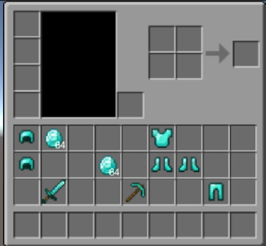

# 第八次3D编程作业：背包系统

[**本次作业源代码链接：点击此处进行跳转**](https://github.com/BrodicVan/3D_game)  
[**演示视频**](https://www.bilibili.com/video/BV1x84y1a7JP/)
## 一、作业目标
制作一个简单的背包系统，展示背包中的物品，通过拖拽可以移动与交换物品，并且可以存储背包信息。

## 二、作业内容
### 1. UI元素
本次作业的UI元素均采自于游戏《我的世界》，以下是部分元素：  
钻石：&emsp;钻石剑：&emsp;钻石镐：&emsp;钻石头盔：&emsp;钻石胸甲：&emsp;钻石护腿：&emsp;钻石靴子：&emsp;  
背包：  
&emsp;

### 2. 主要实现
**预制：**  
(1)slot：代表UI中的一个格子  
  
slot代表某个格子，Item代表内的物体。Item Image和number分别用来表示物品图像与数量，分别有Image组件和Text组件。Item有一个CanvasGroup的组件，后面需要用来控制Item物体的射线遮挡。物品拖动的功能主要是通过改变Item的位置和父对象(不同的slot)来实现。

(2) 背包整体背景

Bag为整个UI的背景，本次作业将其设为透明，将其Image组件的Color中的不透明度设为0。  
Background的Image组件的图片设为背包UI的背景图片。  
Storage则限定了物品UI的显示范围和位置，其包含一个GridLayoutGroup组件，利用该组件可以实现物品(子物体)的规则排列。则在本次作业中，Storage区域只有红色框内的区域，该区域外无法显示物品UI。


**代码：**  
(1) Item.cs：用于存储某件物品的信息
```C#
[CreateAssetMenu(fileName = "New Item", menuName = "Iventory/New Item", order = 1)]
public class Item : ScriptableObject
{
    public string itemName;// 物品名称
    public Sprite itemImage;// 物品图片
    public int itemNum;// 物品数量
}
```
本次作业利用Item这个ScriptableObject对象存储某一个物品。创建完Item对象后需要手动为其各属性进行赋值，示例如下：

(2) Iventory.cs：用于存储背包的物品信息
```C#
[CreateAssetMenu(fileName = "New Iventory", menuName = "Iventory/New Iventory", order = 2)]
public class Iventory : ScriptableObject
{
    public List<Item> itemList = new List<Item>();// 用于存储物品的列表
}
```
手动为Iventory赋值，ItemList中的每个Item代表一个物品，若为null，则代表该位置没有物品。  


(3) Slot.cs：背包中的一个格子,挂载到slot预制上的脚本
```C#
public class Slot : MonoBehaviour
{
    public int slotID;// 格子编号，用于判断格子的位置
    public Item slotItem;// 格子内物品
    public Image itemImage;// 格子内物品的图片
    public Text slotNum;// 格子内物品的数量文本
    public GameObject itemInSlot;// 格子内的物品，是Slot脚本所绑定游戏对象的子对象

    // 根据item初始化格子
    public void SetupSlot(Item item)
    {
        // 没有物品
        if(item==null)
        {
            itemInSlot.SetActive(false);// 不显示格子内物品
            return;
        }
        itemImage.sprite = item.itemImage;// 设置物品图片
        slotNum.text = item.itemNum==1?"":item.itemNum.ToString();// 设置数量文本的内容，若为1则文本为空
    }
}
```

(4) IventoryManage.cs：管理背包的脚本，没有太大的挂载要求，只需游戏对象一直存活即可。本作业中挂载到Bag上
```C#
public class IventoryManager : MonoBehaviour
{
    static IventoryManager instance;// 类实例
    public Iventory myBag;// 所管理的背包存储
    public GameObject slotGrid;// 背包UI所对应的网格
    public GameObject emptySlot;// 空格子的预制体
    public List<GameObject> slots = new List<GameObject>();// 背包UI的游戏物体

    void Awake()
    {
        // 实现单实例
        if(instance != null)
        {
            Destroy(this);
        }
        instance = this;
    }
    
    private void OnEnable()
    {
        // 初始化时刷新背包
        RefreshItem();
    }
   
    public static void RefreshItem()
    {
        // 先删除UI中的所有物体
        for(int i = 0; i < instance.slotGrid.transform.childCount;i++)
        {
            if(instance.slotGrid.transform.childCount==0)
            {
                break;
            }
            Destroy(instance.slotGrid.transform.GetChild(i).gameObject);
        }

        // 根据myBag中的物品数据生成UI物体
        for(int i = 0; i < instance.myBag.itemList.Count;i++)
        {
            // CreateNewItem(instance.myBag.itemList[i]);
            instance.slots.Add(Instantiate(instance.emptySlot));
            instance.slots[i].transform.SetParent(instance.slotGrid.transform);//将UI格子的父对象设为预先选定的网格
            instance.slots[i].GetComponent<Slot>().slotID = i;//设置第i个格子的编号
            instance.slots[i].GetComponent<Slot>().SetupSlot(instance.myBag.itemList[i]);// 初始化第i个格子
        }
    }
}
```
(5) ItemOnDrag.cs：实现UI物体拖动的脚本，挂载到slot预制的Item子物体上
```C#
public class ItemOnDrag : MonoBehaviour,IBeginDragHandler,IDragHandler,IEndDragHandler
{
    public Transform originalParant;// 用于记录拖动前的原父对象
    public Iventory myBag;// 物体所属于的Iventory
    public int currentItemID;// 当前物体的位置ID，用于管理myBag中的内容
    public void OnBeginDrag(PointerEventData eventData)
    {
        originalParant = transform.parent;// 记录原父对象
        currentItemID = originalParant.GetComponent<Slot>().slotID;// 记录当前slot对应的ID
        transform.SetParent(transform.root);// 将Item的父对象设为根，可以自由移动
        transform.position = eventData.position;// Item位置设为鼠标位置
        GetComponent<CanvasGroup>().blocksRaycasts = false;// 取消该Item的射线遮挡，鼠标可以检测到后面的物体
        // Debug.Log(originalParant.name);
    }

    public void OnDrag(PointerEventData eventData)
    {
        transform.position = eventData.position;// 拖拽过程中Item的位置随鼠标移动
        // Debug.Log(eventData.pointerCurrentRaycast.gameObject.name);
    }

    public void OnEndDrag(PointerEventData eventData)
    {
        GameObject tar_object = eventData.pointerCurrentRaycast.gameObject;// 获取鼠标当前指向的游戏物体
        
        Debug.Log(tar_object.name);
        // 指向别的物体，交换物体
        if(tar_object.name == "Item Image" || tar_object.name == "number")品
        {
            int tar_id = tar_object.GetComponentInParent<Slot>().slotID;// 获取目标的位置编号

            // 改变Item的父对象和位置，将其固定到新的slot上
            transform.SetParent(tar_object.transform.parent.parent);//parent为Item，parent.parent才是slot
            transform.localPosition = Vector3.zero;

            var tem = myBag.itemList[currentItemID];
            myBag.itemList[currentItemID] = myBag.itemList[tar_id];
            myBag.itemList[tar_id] = tem;

            // 目标Item的父对象和位置设为该Item的原父对象和位置
            tar_object.transform.parent.SetParent(originalParant);
            tar_object.transform.parent.localPosition = Vector3.zero;
        }
        else if(tar_object.name == "slot(Clone)")// 放到空格子
        {
            int tar_id = tar_object.GetComponentInParent<Slot>().slotID;
            // 更新背包存储的信息
            var tem = myBag.itemList[tar_id];
            myBag.itemList[tar_id] = myBag.itemList[currentItemID];
            myBag.itemList[currentItemID] = tem;
            transform.SetParent(tar_object.transform);
            transform.localPosition = Vector3.zero;
        }
        else// 移到其他任何位置，回到原位
        {
            transform.SetParent(originalParant);
            transform.localPosition = Vector3.zero;
        }
        GetComponent<CanvasGroup>().blocksRaycasts = true;// 移动完毕开启射线检测，等待下次被选中
    }
}
```  

## 三、作业演示
**演示截图**  
   

[**演示视频：请点击该链接进行查看**](https://www.bilibili.com/video/BV1x84y1a7JP/)

## 四、参考资料
**B站Up主[@M_Studio](https://space.bilibili.com/370283072)的[背包UI教程](https://www.bilibili.com/video/BV1YJ41197SU/?spm_id_from=333.999.0.0&vd_source=057a2b7e5be3dc8b29f8d32fd4e65aeb)**